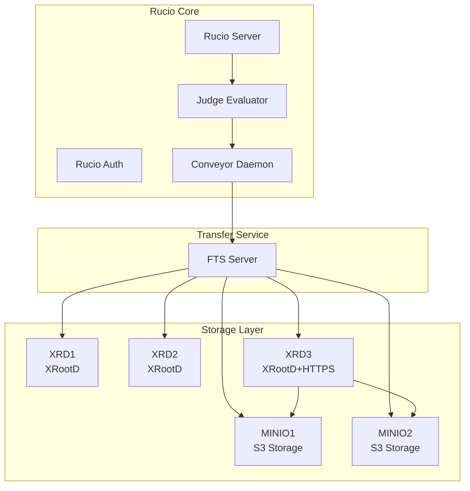

# Getting Started with the Rucio Docker Playground

:::info[Overview]
This tutorial walks you through setting up a complete Rucio test environment using Docker Compose. The playground includes 17 containers with XRootD servers, MinIO S3 storage, FTS (File Transfer Service), and a full Rucio stack for testing data replication and multi-hop transfers.
:::

## Prerequisites

Before starting, ensure you have the following installed:

- **Docker** (with Docker Compose support)
- **Python 3** (for Rucio clients)
- **Basic understanding** of Rucio concepts (RSEs, replication rules, datasets)

## Tutorial Scripts Overview

This tutorial uses a series of numbered scripts that progressively set up and configure your Rucio playground environment. Each script builds on the previous one to create a fully functional test infrastructure.

### Environment Management Scripts

#### qt-999-down.sh - Clean Up Environment

Stops and removes all Docker containers, volumes, and resources from the Rucio playground. Use this to start fresh or clean up after testing.

```bash
./qt-999-down.sh
```

**What it does:**
- Stops all running containers
- Removes containers and networks
- Prunes orphaned containers
- Attempts to clean up unused volumes

:::warning[Volume Persistence Issue]
The `docker volume prune -f` command only removes **unused** volumes, not the ones that might still be referenced. **PostgreSQL database volumes persist** between runs, keeping old schema objects.

To completely clean up, you may need to manually remove specific volumes:

```bash
docker volume rm dev_vol-ruciodb-data1 2>/dev/null
docker volume rm dev_vol-ftsdb-mysql1 2>/dev/null
```
:::

#### qt-000-up.sh - Start the Environment

Launches the complete Docker Compose stack with all storage services and the Rucio infrastructure.

```bash
./qt-000-up.sh
```

**What it does:**
- Generates MinIO SSL certificates
- Starts 17 containers including:
  - XRootD servers (XRD1, XRD2, XRD3)
  - MinIO instances (MINIO1, MINIO2)
  - File Transfer Service (FTS)
  - Rucio server and daemons
  - PostgreSQL database

:::tip[Wait for Services]
After running this script, wait 30-60 seconds for all services to fully initialize before proceeding to the next step.
:::

### Configuration Scripts

#### qt-001-initialize.sh - Initialize Rucio

Runs the Rucio initialization script that sets up the basic Rucio infrastructure.

```bash
./qt-001-initialize.sh
```

**What it does:**
- Creates test scopes
- Creates initial datasets
- Registers XRootD RSEs (XRD1, XRD2, XRD3)
- Sets up basic RSE attributes

#### qt-002-xrd3-http-protocol.sh - Add HTTPS Protocol

Adds HTTPS protocol support to the XRD3 RSE, enabling it to communicate with S3 backends for multi-hop transfers.

```bash
./qt-002-xrd3-http-protocol.sh
```

**What it does:**
- Configures HTTPS protocol on XRD3
- Enables S3 compatibility for multi-hop routing
- Sets protocol priorities for WAN and LAN operations

#### qt-003-minio-buckets.sh - Create MinIO Buckets

Creates the necessary storage buckets on MinIO instances.

```bash
./qt-003-minio-buckets.sh
```

**What it does:**
- Creates the `rucio` bucket on MinIO instances
- Sets appropriate bucket policies
- Verifies bucket creation

#### qt-004-minio-rses.sh - Configure MinIO RSEs

Registers MinIO instances as Rucio Storage Elements with S3 protocol configuration.

```bash
./qt-004-minio-rses.sh
```

**What it does:**
- Registers MINIO1 and MINIO2 as Rucio RSEs
- Configures S3 protocol endpoints
- Sets up storage credentials
- Configures FTS endpoints for each MinIO RSE
- Establishes network distances between MinIO RSEs and XRD3 for multi-hop routing

:::tip[Understanding RSE Distance]
RSE distance determines routing for data transfers. A distance of 1 means direct transfer is possible. Setting distances between MINIO RSEs and XRD3 enables multi-hop transfers through XRD3.
:::

#### qt-005-minio-fts-creds.sh - Configure FTS Credentials

Registers S3 storage credentials in the File Transfer Service (FTS).

```bash
./qt-005-minio-fts-creds.sh
```

**What it does:**
- Registers S3 storage credentials for both MinIO instances in FTS
- Allows FTS to authenticate and perform third-party copy operations
- Configures GFAL2 S3 settings for proper S3 protocol handling

:::info[What is FTS?]
FTS (File Transfer Service) is responsible for executing actual data transfers between storage endpoints. It handles authentication, retries, checksums, and provides monitoring for transfers.
:::

### Data Management Scripts

#### qt-006-simple-upload.sh - Upload Test Data

Creates and uploads initial test files to MinIO instances.

```bash
./qt-006-simple-upload.sh
```

**What it does:**
- Generates two random test files
- Uploads one file to MINIO1
- Uploads one file to MINIO2
- Adds files to test datasets for replication testing

#### qt-007-replication-rules.sh - Create Replication Rules

Creates replication rules to trigger data transfers between storage endpoints.

```bash
./qt-007-replication-rules.sh
```

**What it does:**
- Creates a replication rule to copy dataset to XRD1
- Creates a replication rule to copy dataset to MINIO2
- Triggers the Rucio rule evaluation workflow

:::tip[Monitoring Rules]
After creating rules, you can monitor their progress using:
```bash
rucio rule list --account root
rucio rule show --rule-id <rule_id>
```
:::

#### qt-008-replicate-loop.sh - Execute Replication Cycle

Runs a single iteration of the Rucio replication cycle to process pending transfers.

```bash
./qt-008-replicate-loop.sh
```

**What it does:**
- Executes `rucio-judge-evaluator --run-once`
- Evaluates pending replication rules
- Submits transfer requests to FTS
- Updates rule states based on transfer results

:::info[Running Continuously]
In a production environment, these daemons run continuously. This script executes a single cycle for testing purposes. You may need to run it multiple times or check daemon logs to see transfers complete.
:::

## Complete Workflow Example

Here's the complete sequence to set up and test the Rucio Docker playground:

### 1. Clean Up (if needed)

```bash
# Remove any existing environment
./qt-999-down.sh

# Remove persistent volumes if needed
docker volume rm dev_vol-ruciodb-data1 2>/dev/null
docker volume rm dev_vol-ftsdb-mysql1 2>/dev/null
```

### 2. Start Environment

```bash
# Launch all containers
./qt-000-up.sh

# Wait for services to initialize
sleep 60
```

### 3. Configure Rucio

```bash
# Initialize Rucio infrastructure
./qt-001-initialize.sh

# Configure XRD3 for S3 multi-hop
./qt-002-xrd3-http-protocol.sh
```

### 4. Configure MinIO Storage

```bash
# Create storage buckets
./qt-003-minio-buckets.sh

# Register MinIO RSEs in Rucio
./qt-004-minio-rses.sh

# Configure FTS credentials
./qt-005-minio-fts-creds.sh
```

### 5. Test Data Transfers

```bash
# Upload initial test data
./qt-006-simple-upload.sh

# Create replication rules
./qt-007-replication-rules.sh

# Execute replication cycle
./qt-008-replicate-loop.sh
```

### 6. Monitor Transfers

```bash
# Check rule status
rucio rule list --account root

# Check file replicas
rucio replicas list --did test:file1

# Check FTS transfers
rucio transfer list
```

## Troubleshooting

### Common Issues

#### Database Schema Conflicts

**Problem:** Old database schema objects persist between runs.

**Solution:**
```bash
# Remove database volumes completely
docker volume rm dev_vol-ruciodb-data1 2>/dev/null
docker volume rm dev_vol-ftsdb-mysql1 2>/dev/null

# Restart environment
./qt-000-up.sh
```

#### Containers Not Starting

**Problem:** Containers fail to start or exit immediately.

**Solution:**
```bash
# Check container logs
docker logs <container_name>

# Verify Docker resources
docker system df

# Clean up Docker system
docker system prune -a
```

#### Transfers Not Completing

**Problem:** Replication rules stay in REPLICATING state.

**Solution:**
```bash
# Run replication cycle multiple times
./qt-008-replicate-loop.sh

# Check FTS logs
docker logs fts

# Verify RSE availability
rucio rse info XRD1
rucio rse info MINIO1
```

#### S3 Authentication Failures

**Problem:** MinIO transfers fail with authentication errors.

**Solution:**
```bash
# Re-run FTS credential configuration
./qt-005-minio-fts-creds.sh

# Verify MinIO credentials in FTS
docker exec -it fts cat /etc/fts3/config
```

## Architecture Overview

The Docker playground creates the following infrastructure:



### Multi-Hop Transfer Flow

The playground demonstrates multi-hop transfers where data flows from MinIO through XRD3 to other destinations:

1. User creates replication rule
2. Judge Evaluator processes rule
3. Conveyor submits transfer to FTS
4. FTS orchestrates multi-hop transfer:
   - MINIO1/2 → XRD3 (S3 to HTTPS)
   - XRD3 → XRD1/2 (XRootD protocol)

## Next Steps

After completing this tutorial, you can:

- **Experiment with different replication rules** to understand rule evaluation
- **Test multi-hop transfers** between MinIO and XRootD RSEs
- **Monitor daemon behavior** by checking container logs
- **Add custom RSEs** to expand the playground
- **Test failure scenarios** by stopping containers mid-transfer

## Additional Resources

- [Rucio Documentation](https://rucio.cern.ch/documentation)
- [Setting up the Rucio Client](../user/setting_up_the_rucio_client.md)
- [Administration Guide](./administration.md)
- [Kubernetes Tutorial](./k8s_guide.md) - For production deployments
